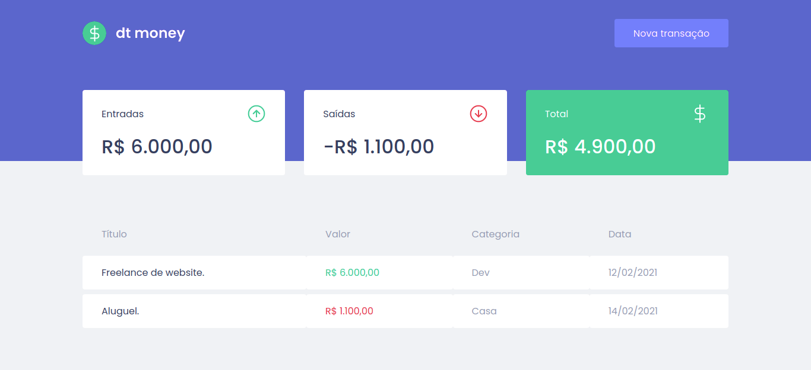
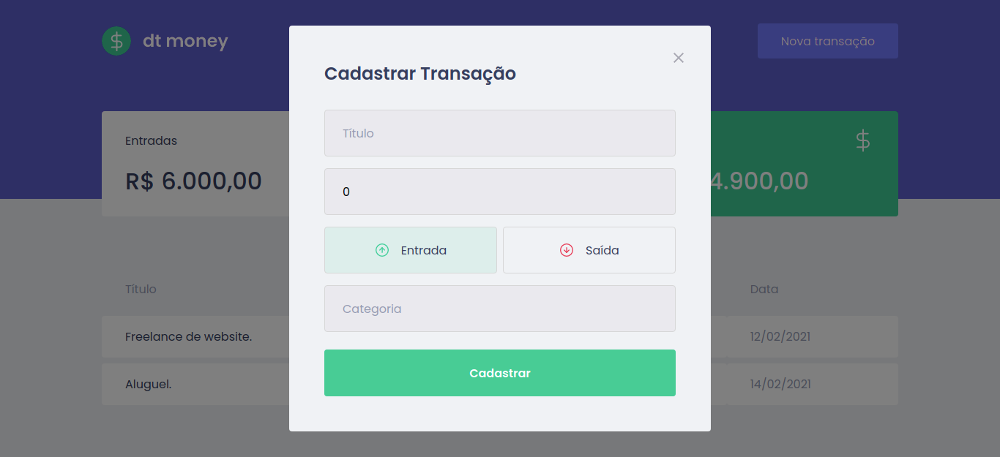

# Rocketseat Ignite - dt-money ReactJS

## 🚀 Technologies
- ReactJS
- TypeScript
- useState
- useEfect
- Context API
- Styled Components
- Mirage JS
- Axios
- React Modal
- Polished

## Steps to Setup

1. Install dependencies

```bash
> yarn
```

2. Run app

```bash
> yarn start
```

Open <http://localhost:3000> to view it in the browser.



